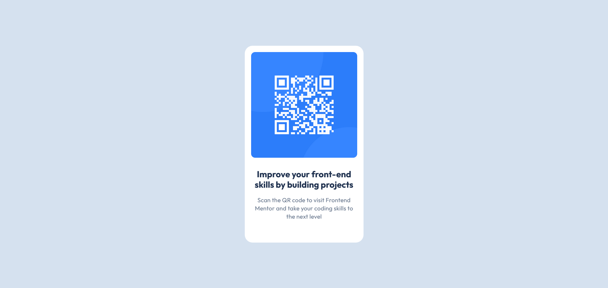

# Frontend Mentor - QR code component solution

This is a solution to the [QR code component challenge on Frontend Mentor](https://www.frontendmentor.io/challenges/qr-code-component-iux_sIO_H). Frontend Mentor challenges help you improve your coding skills by building realistic projects. 

## Table of contents

- [Frontend Mentor - QR code component solution](#frontend-mentor---qr-code-component-solution)
  - [Table of contents](#table-of-contents)
    - [Screenshot](#screenshot)
    - [Links](#links)
    - [Built with](#built-with)
  - [Author](#author)

**Note: Delete this note and update the table of contents based on what sections you keep.**

### Screenshot

### Links

- Solution URL: [solution URL](https://www.frontendmentor.io/solutions/responsive-qr-code-component-using-html-and-css-S_9QnMQ13H)
- Live Site URL: [Qr Code Component](https://ndzalamabasa.github.io/qr-code-component/)

### Built with

- Semantic HTML5 markup
- CSS custom properties
- Flexbox
- Mobile-first workflow

## Author

- Website - [Ndzalama Mabasa](https://mabasan.co.za)
- Frontend Mentor - [@ndzalamabasa](https://www.frontendmentor.io/profile/ndzalamabasa)